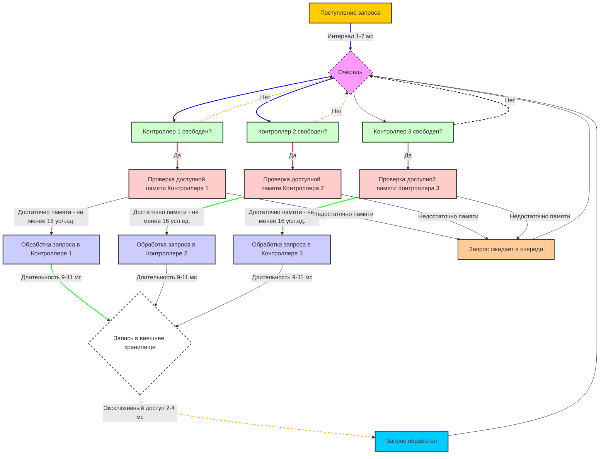

# memraid-test

```mermaid
graph TD
    A[Поступление запроса] -->|Интервал 1-7 мс| B{Очередь}
    B --> C[Контроллер 1 свободен?]
    B --> D[Контроллер 2 свободен?]
    B --> E[Контроллер 3 свободен?]
    
    C -->|Да| F[Проверка доступной памяти Контроллера 1]
    D -->|Да| G[Проверка доступной памяти Контроллера 2]
    E -->|Да| H[Проверка доступной памяти Контроллера 3]
    
    F -->|Достаточно памяти - не менее 16 усл.ед.| I[Обработка запроса в Контроллере 1]
    G -->|Достаточно памяти - не менее 16 усл.ед.| J[Обработка запроса в Контроллере 2]
    H -->|Достаточно памяти - не менее 16 усл.ед.| K[Обработка запроса в Контроллере 3]
    
    I -->|Длительность 9-11 мс| L{Запись в внешнее хранилище}
    J -->|Длительность 9-11 мс| L
    K -->|Длительность 9-11 мс| L
    
    L -->|Эксклюзивный доступ 2-4 мс| M[Запрос обработан]
    
    C -->|Нет| B
    D -->|Нет| B
    E -->|Нет| B

    F -->|Недостаточно памяти| N[Запрос ожидает в очереди]
    G -->|Недостаточно памяти| N
    H -->|Недостаточно памяти| N
    
    N --> B
    
    M --> B

    %% Стилизация узлов
    style A fill:#ffcc00,stroke:#333,stroke-width:2px
    style B fill:#f9f,stroke:#333,stroke-width:2px,stroke-dasharray: 5 5
    style C fill:#ccffcc,stroke:#333,stroke-width:2px
    style D fill:#ccffcc,stroke:#333,stroke-width:2px
    style E fill:#ccffcc,stroke:#333,stroke-width:2px
    style F fill:#ffcccc,stroke:#333,stroke-width:2px
    style G fill:#ffcccc,stroke:#333,stroke-width:2px
    style H fill:#ffcccc,stroke:#333,stroke-width:2px
    style I fill:#ccccff,stroke:#333,stroke-width:2px
    style J fill:#ccccff,stroke:#333,stroke-width:2px
    style K fill:#ccccff,stroke:#333,stroke-width:2px
    style L fill:#fff,stroke:#333,stroke-width:2px,stroke-dasharray: 5 5
    style M fill:#00ccff,stroke:#333,stroke-width:2px
    style N fill:#ffcc99,stroke:#333,stroke-width:2px

    %% Стилизация ребер
    linkStyle default stroke:#333,stroke-width:1px
    linkStyle 0,1,2 stroke:#0000ff,stroke-width:2px
    linkStyle 4,5,6 stroke:#ff0000,stroke-width:2px
    linkStyle 8,9,10 stroke:#00ff00,stroke-width:2px
    linkStyle 13,14,15 stroke:#ffa500,stroke-width:2px,stroke-dasharray: 5 5
    linkStyle 16 stroke:#000,stroke-width:2px,stroke-dasharray: 5 5
```
