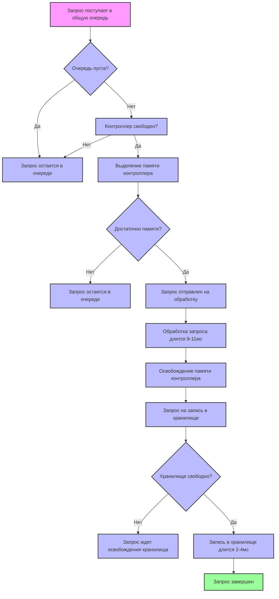

# memraid-test

```mermaid
graph TD
    A[Запрос поступает в общую очередь] --> B{Очередь пуста?}
    B -- Да --> C[Запрос остается в очереди]
    B -- Нет --> D[Контроллер свободен?]
    D -- Нет --> C
    D -- Да --> E[Выделение памяти контроллера]
    E --> F{Достаточно памяти?}
    F -- Нет --> G[Запрос остается в очереди]
    F -- Да --> H[Запрос отправлен на обработку]
    H --> I[Обработка запроса длится 9-11мс]
    I --> J[Освобождение памяти контроллера]
    J --> K[Запрос на запись в хранилище]
    K --> L{Хранилище свободно?}
    L -- Нет --> M[Запрос ждет освобождения хранилища]
    L -- Да --> N[Запись в хранилище длится 2-4мс]
    N --> O[Запрос завершен]

    style A fill:#f9f,stroke:#333,stroke-width:2px;
    style B fill:#bbf,stroke:#333,stroke-width:2px;
    style C fill:#bbf,stroke:#333,stroke-width:2px;
    style D fill:#bbf,stroke:#333,stroke-width:2px;
    style E fill:#bbf,stroke:#333,stroke-width:2px;
    style F fill:#bbf,stroke:#333,stroke-width:2px;
    style G fill:#bbf,stroke:#333,stroke-width:2px;
    style H fill:#bbf,stroke:#333,stroke-width:2px;
    style I fill:#bbf,stroke:#333,stroke-width:2px;
    style J fill:#bbf,stroke:#333,stroke-width:2px;
    style K fill:#bbf,stroke:#333,stroke-width:2px;
    style L fill:#bbf,stroke:#333,stroke-width:2px;
    style M fill:#bbf,stroke:#333,stroke-width:2px;
    style N fill:#bbf,stroke:#333,stroke-width:2px;
    style O fill:#9f9,stroke:#333,stroke-width:2px;
```
